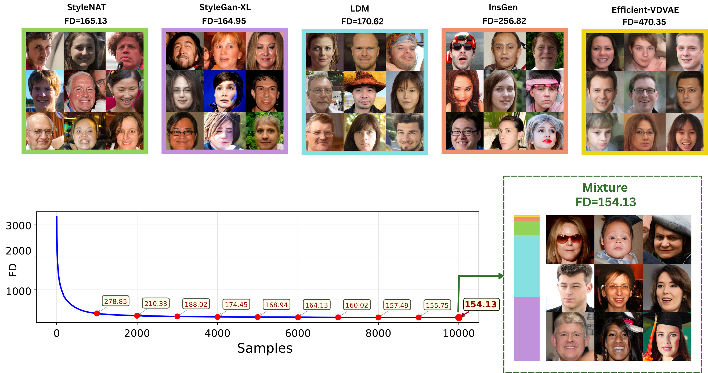

# Mixture-Greedy for Online Generative Model Selection

This repository contains the official implementation for:

**Mixture-Greedy for Online Generative Model Selection:  
Do We Always Need UCB in Diversity-Aware Multi-Armed Bandits?**

The code implements Mixture-Greedy, a simple online mixture-selection algorithm for choosing among multiple generative models under diversity-aware evaluation objectives. Unlike Mixture-UCB methods, Mixture-Greedy optimizes the empirical mixture objective directly, without adding an explicit UCB exploration bonus. 

<p align="center">
  
</p>

## Abstract

Efficient selection among multiple generative models is increasingly important in modern generative AI, where sampling from suboptimal models is costly. This problem can be formulated as a multi-armed bandit task. Under diversity-aware evaluation metrics, a non-degenerate mixture of generators can outperform any individual model, distinguishing this setting from classical best-arm identification. Prior approaches therefore incorporate an Upper Confidence Bound (UCB) exploration bonus into the mixture objective. However, across multiple datasets and evaluation metrics, we observe that the UCB term consistently slows convergence and often reduces sample efficiency. In contrast, a simple \emph{Mixture-Greedy} strategy without explicit UCB-type optimism converges faster and achieves even better performance, particularly for widely used metrics such as FID and Vendi, where tight confidence bounds are difficult to construct. We provide theoretical insight explaining this behavior: under transparent structural conditions, diversity-aware objectives induce implicit exploration by favoring interior mixtures, leading to linear sampling of all arms and sublinear regret guarantees for entropy-based, kernel-based, and FID-type objectives. These results suggest that in diversity-aware multi-armed bandits for generative model selection, exploration can arise intrinsically from the objective geometry, questioning the necessity of explicit confidence bonuses.
This repository supports experiments with:

- **Image-generation benchmarks**, including FFHQ, ImageNet, and LSUN-Bedroom.
- **Text-generation benchmarks**, such as city-name generation.
- **Text-to-image generation benchmarks**, including red-bird and dog-breed prompts.
- Multiple objectives, including:
  - Fréchet Distance / FD
  - Vendi Score
  - RKE / inverse-RKE
  - Kernel Distance / KD

The main goal is to study whether diversity-aware mixture objectives can induce implicit exploration, making explicit UCB bonuses unnecessary in several practical settings.

## Method

Mixture-Greedy maintains a mixture distribution over a set of generators. At each round, it solves

```math
\alpha_t \in \arg\min_{\alpha \in \Delta_m} \widehat{L}_{t-1}(\alpha),
