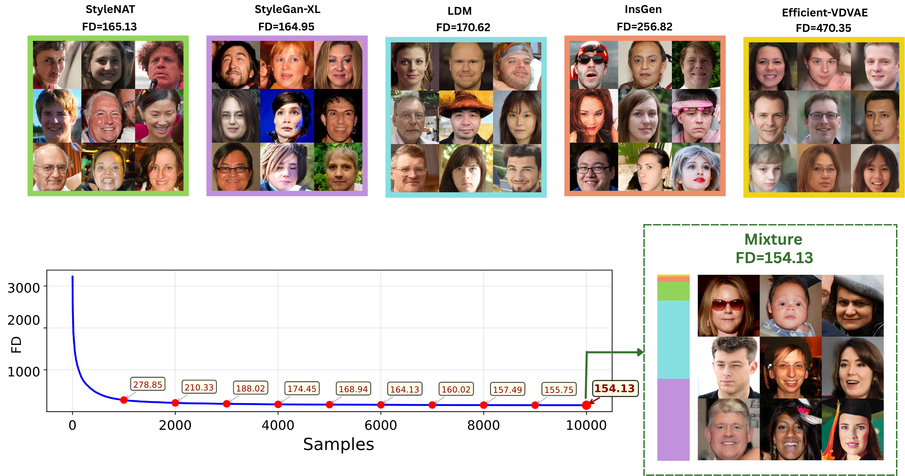

# Mixture-Greedy for Online Generative Model Selection

This repository contains the official implementation for:

**[Mixture-Greedy for Online Generative Model Selection:  
Do We Always Need UCB in Diversity-Aware Multi-Armed Bandits?](https://arxiv.org/abs/2603.21716), UAI 2026**


The code implements Mixture-Greedy, a simple online mixture-selection algorithm for choosing among multiple generative models under diversity-aware evaluation objectives. Unlike Mixture-UCB methods, Mixture-Greedy optimizes the empirical mixture objective directly, without adding an explicit UCB exploration bonus. 

<p align="center">
  
</p>

## Abstract

Efficient selection among multiple generative models is increasingly important in modern generative AI, where sampling from suboptimal models is costly. This problem can be formulated as a multi-armed bandit task. Under diversity-aware evaluation metrics, a non-degenerate mixture of generators can outperform any individual model, distinguishing this setting from classical best-arm identification. Prior approaches therefore incorporate an Upper Confidence Bound (UCB) exploration bonus into the mixture objective. However, across multiple datasets and evaluation metrics, we observe that the UCB term consistently slows convergence and often reduces sample efficiency. In contrast, a simple \emph{Mixture-Greedy} strategy without explicit UCB-type optimism converges faster and achieves even better performance, particularly for widely used metrics such as FID and Vendi, where tight confidence bounds are difficult to construct. We provide theoretical insight explaining this behavior: under transparent structural conditions, diversity-aware objectives induce implicit exploration by favoring interior mixtures, leading to linear sampling of all arms and sublinear regret guarantees for entropy-based, kernel-based, and FID-type objectives. These results suggest that in diversity-aware multi-armed bandits for generative model selection, exploration can arise intrinsically from the objective geometry, questioning the necessity of explicit confidence bonuses.
This repository supports experiments with:

- **Image-generation benchmarks**, including FFHQ, ImageNet, and LSUN-Bedroom.
- **Text-generation benchmarks**, such as city-name generation.
- **Text-to-image generation benchmarks**, including red-bird and dog-breed prompts.
- Multiple objectives, including:
  - Fréchet Distance / FD
  - Vendi Score
  - RKE / inverse-RKE
  - Kernel Distance / KD

The main goal is to study whether diversity-aware mixture objectives can induce implicit exploration, making explicit UCB bonuses unnecessary in several practical settings.

## Method

Mixture-Greedy maintains a mixture distribution over a set of generators. At each round, it solves


$$
\alpha_t \in \arg\min_{\alpha \in \Delta_m} \widehat{L}_{t-1}(\alpha)
$$


In this work, we proved that diversity-aware objectives for mixture selection induce implicit exploration without requiring an explicit exploration bonus.


## Getting started

### 1. Clone the repository

```bash
git clone <repository-url>
cd Mixture-Greedy
```

### 2. Create an environment and install the package

Python 3.10 or newer is required.

```bash
python -m venv .venv
source .venv/bin/activate
python -m pip install --upgrade pip
python -m pip install -e .
```

A CUDA-enabled PyTorch installation is optional. The implementation also runs
on CPU.

### 3. Prepare feature archives

Each model or arm is represented by a two-dimensional feature array with shape
`(number_of_samples, feature_dimension)`, stored in an NPZ archive. A typical
layout is:

```text
<data-root>/
└── <dataset>/
    └── features/
        ├── <model>.npz
        ├── <feature-extractor>/
        │   └── <model>.npz
        └── CLIP/
            └── <model>.npz
```

The loaders recognize arrays named `dino_features`, `clip_features`,
`inception_features`, `sbert_features`, or `features`. They also recognize the
key `<feature-extractor>_features` selected with `--feature-extractor`.

Set the data root before running an experiment:

```bash
export MIXTURE_GREEDY_DATA_ROOT=/absolute/path/to/data
```

FID also needs an NPZ archive containing features from the real/reference
dataset. Supply that archive separately with `--real-dataset`.

### 4. Select an objective and run

The unified command supports `rke`, `kid`, `fid`, and `vne`:

```bash
python -m mixture_greedy --help
```

RKE example:

```bash
python -m mixture_greedy \
  --metric rke \
  --dataset FFHQ256 \
  --models model_a model_b model_c \
  --feature-extractor dino \
  --rounds 1000 \
  --output results/rke.npz
```

KID uses the same evaluator with a different objective:

```bash
python -m mixture_greedy \
  --metric kid \
  --dataset FFHQ256 \
  --models model_a model_b model_c \
  --feature-extractor dino \
  --rounds 1000 \
  --output results/kid.npz
```

FID requires reference features:

```bash
python -m mixture_greedy \
  --metric fid \
  --dataset FFHQ256 \
  --models model_a model_b model_c \
  --feature-extractor dino \
  --real-dataset /absolute/path/to/real_features.npz \
  --optimizer scipy \
  --rounds 1000 \
  --output results/fid.npz
```

VNE/Vendi example:

```bash
python -m mixture_greedy \
  --metric vne \
  --dataset FFHQ256 \
  --models model_a model_b model_c \
  --feature-extractor dino \
  --kernel-type cosine \
  --rounds 1000 \
  --output results/vne.npz
```

### 5. Inspect the output

The output NPZ archive contains a common schema for every objective:

- `metric`: selected objective;
- `scores`: metric values observed during the run;
- `alpha_history`: mixture weights over rounds;
- `sample_sizes`: final number of samples drawn from each model.

```python
import numpy as np

result = np.load("results/vne.npz")
print(result["alpha_history"][-1])
print(result["scores"][-1])
```

## Architecture

The folders have distinct responsibilities:

| Layer | Responsibility | Examples |
| --- | --- | --- |
| `mixture_greedy/metrics/` | Pure numerical objectives; no experiment loop | FID moments, VNE entropy, RKE kernels |
| `mixture_greedy/rke_online.py` and `rke_offline.py` | RKE/KID sampling and optimization | `RKEOnlineEvaluator`, `RKEOfflineEvaluator` |
| `mixture_greedy/runner.py` | Chooses and runs an evaluator by metric name | `run_evaluation("fid", ...)` |
| `FID_online.py` | FID evaluator and legacy FID reporting utilities | `FIDOnlineEvaluator` |
| `VNE_online_new.py` | VNE evaluator and legacy VNE reporting utilities | `VNEOnlineEvaluator` |

The call direction is intentionally one-way:

```text
CLI / runner -> evaluator -> metric math
```

The metrics folder is therefore not a second implementation. The evaluator
files contain sampling and optimization; they call the reusable equations in
the metrics folder. The previous empty FID and VNE evaluator wrappers were
removed—the package API now points directly to `FID_online.py` and
`VNE_online_new.py`.

## Strategies and optional behavior

Use `--mode` instead of editing or uncommenting source code:

| Metric | Supported modes |
| --- | --- |
| RKE/KID | `mixture-greedy`, `mixture-greedy-eg`, `mixture-ucb`, `mixture-oracle`, `one-arm-ucb`, `one-arm-oracle` |
| FID/VNE | `mixture-greedy`, `mixture-oracle`, `one-arm-greedy`, `one-arm-eps-greedy` |

Important optional switches include:

```bash
# FID: choose exponentiated gradient instead of SciPy
python -m mixture_greedy ... --metric fid --optimizer eg --eg-eta 0.001 --eg-steps 100

# VNE: activate random Fourier features
python -m mixture_greedy ... --metric vne --kernel-type rff --rff-features 256 --rff-sigma 30

# FID: activate fixed-moment mixture-FID monitoring
python -m mixture_greedy ... --metric fid --track-mixture-fid --mixture-fid-samples 10000

# Activate an adaptive experiment without modifying source
python -m mixture_greedy ... --adaptive change-point --change-point-path /path/to/change.npz
```

Run `python -m mixture_greedy --help` for all optimizer, exploration, kernel,
and adaptive-dataset options. Invalid metric/mode combinations are rejected
before data are loaded.

The same interface is available from Python:

```python
from mixture_greedy import run_evaluation

result = run_evaluation(
    "vne",
    ["poodle", "bulldog", "german_shepherd"],
    "t2i_dog",
    rounds=1000,
)
```

## Supported implementations

| Metric | Evaluator | Pure objective |
| --- | --- | --- |
| RKE | `RKEOnlineEvaluator` | `mixture_greedy.metrics.rke` |
| KID | `RKEOnlineEvaluator` with `QUADRATIC_METRIC="kid"` | `mixture_greedy.metrics.rke` |
| FID | `FIDOnlineEvaluator` | `mixture_greedy.metrics.fid` |
| VNE/Vendi | `VNEOnlineEvaluator` | `mixture_greedy.metrics.vne` |

The top-level FID and VNE filenames are retained because existing experiment
scripts import them. Their evaluator bodies have been cleaned, while their
plotting/post-processing functions remain available for old experiments.

Other VNE files in the research directory are earlier experimental variants
and are not part of the supported package API.

## Package API

The package exposes stable imports while loading metric-specific evaluators
only when required:

```python
from mixture_greedy import Config, RKEOfflineEvaluator, RKEOnlineEvaluator
from mixture_greedy import create_config, create_evaluator, run_evaluation
from mixture_greedy.data import load_features_from_npz
```

## Compatibility contract

The refactor preserves:

- legacy module names and public symbols;
- configuration defaults and accepted mode strings;
- mathematical formulas and optimizer settings;
- NumPy/Torch random-call ordering;
- output directories, filenames, text summaries, and NPZ keys;
- existing warning, exception, and assertion behavior.

Apparent numerical or control-flow defects are intentionally not changed in a
behavior-preserving commit. Such fixes should be proposed separately with a
specific regression test and migration note.


## Paper

[Read the paper (PDF)](https://arxiv.org/abs/2603.21716)

@article{nia2026exploration,
  title={When Exploration Comes for Free with Mixture-Greedy: Do we need UCB in Diversity-Aware Multi-Armed Bandits?},
  author={Nia, Bahar Dibaei and Farnia, Farzan},
  journal={arXiv preprint arXiv:2603.21716},
  year={2026}
}
